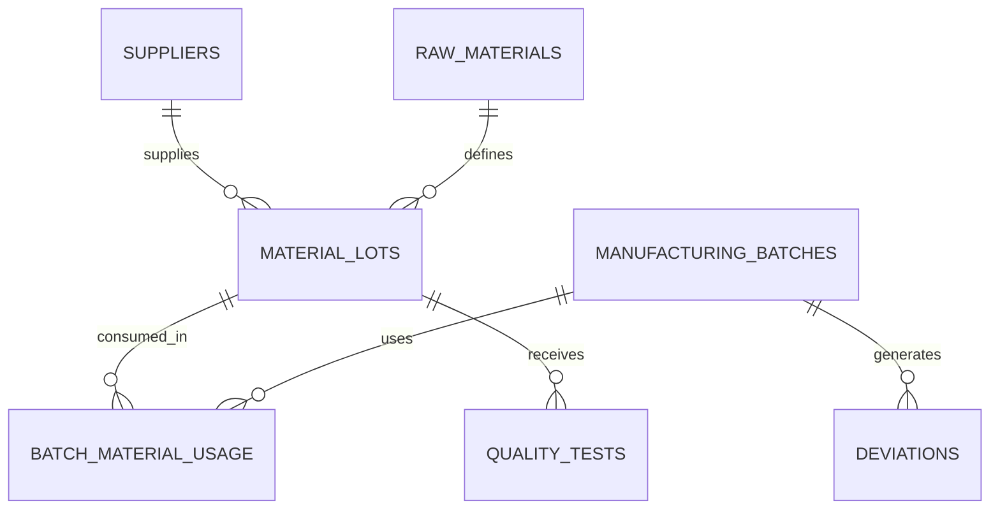

# MSAT Raw Material Traceability & Quality Analytics

An interview-ready portfolio project demonstrating advanced SQL and Python for GMP manufacturing, raw-material traceability, supplier quality, deviation investigation, and manufacturing analytics.

## Business Objective

MSAT and Quality teams need to trace raw-material lots through manufacturing batches, identify supplier and material risks, investigate deviations, and summarize quality performance across sites and time periods.

## Skills Demonstrated

- Normalized relational database design
- Primary keys, foreign keys, constraints, and indexes
- Complex joins across manufacturing, supplier, material, quality, and deviation tables
- Common Table Expressions (CTEs)
- Recursive CTEs for material genealogy
- Window functions: LAG, RANK, DENSE_RANK, and NTILE
- Conditional aggregation
- Rolling quality metrics
- Supplier scorecards and batch risk ranking
- Python-to-SQL integration with pandas and SQLAlchemy

## Technology

PostgreSQL 15+, Python 3.10+, pandas, SQLAlchemy, psycopg2.

## Database Model



## Featured SQL Analyses

1. End-to-end batch and raw-material lot traceability
2. Supplier defect-rate ranking with window functions
3. Rolling three-lot quality-failure rates
4. Recurrent deviation detection using LAG
5. Batch-level material risk scoring
6. Pareto analysis of deviation categories
7. Recursive material genealogy
8. Quarantine aging
9. Month-over-month incoming quality trends
10. Material-waste outlier detection

## Interview Talking Point

> I designed a normalized PostgreSQL data model linking suppliers, raw-material lots, quality tests, manufacturing batches, material usage, and deviations. I created advanced SQL analyses using CTEs, recursive CTEs, window functions, conditional aggregation, and indexed views to support material traceability, supplier quality scorecards, and deviation investigations. Python retrieves and exports the analytical outputs.

## Run Order

```bash
psql -d msat_traceability -f sql/01_schema.sql
psql -d msat_traceability -f sql/02_seed_data.sql
psql -d msat_traceability -f sql/03_views_and_indexes.sql
psql -d msat_traceability -f sql/04_advanced_queries.sql
pip install -r requirements.txt
python python/msat_sql_analysis.py
```

All data is synthetic and contains no employer, patient, product, or proprietary information.
